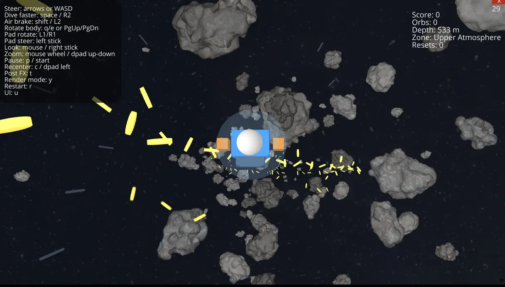

# Planetfall

A largely vibe coded third-person endless falling game built with Ursina and Python,
similar to the memorable parts from LEGO City Undercover.

The player dives from deep space toward a distant planet, steers around
obstacles, and collects chained glowing coins while descending.



## Requirements

- `uv`

## Quick Start

```bash
uv python install 3.14.3
uv sync
uv run planetfall               # launch the game
uv run planetfall --fullscreen  # launch the game in fullscreen mode
uv run planetfall --seed 12345  # deterministic spawn layouts and powerup placement
uv run planetfall --help        # show command help
```

## Controls

- Arrow keys or `WASD`: steer while falling
- `Space`: dive faster
- Left Shift / Right Shift: air brake
- `Q` / `E` and `PgUp` / `PgDn`: rotate body left/right
- Obstacle hit: rumble + reset a bit higher (no death)
- Halo coins are high-value bonus pickups
- Mouse move: orbit look (captured cursor)
- Mouse wheel: zoom in/out
- `p`: pause/resume
- `c`: recenter camera
- `v`: toggle auto yaw
- `r`: restart run
- `u`: toggle controls hint

## Powerups

- Magnet (magenta): pulls nearby coins while active.
- Shield (cyan): negates one obstacle hit while active.
- Multiplier (gold): increases coin score while active.

### PS5 Controller (Generic Gamepad Mapping)

Ursina exposes standard gamepad names, so PS5 controls map as:

- Left stick: steer
- R2 / L2: dive faster / air brake
- L1 / R1: rotate body left/right
- Right stick: camera look
- D-pad up/down: zoom in/out
- D-pad left: recenter camera
- D-pad right: toggle auto yaw
- Start: pause/resume

## Project Layout

- [pyproject.toml](pyproject.toml): project metadata and tool/lint configuration
- [planetfall/](planetfall/): application package and CLI entrypoint
- [planetfall/game/](planetfall/game/): runtime, control logic, procedural falling-scene generation
- [tests/](tests/): test suite

## Full Setup and Checks

```bash
# install the pinned Python version
uv python install 3.14.3

# create/update virtual environment and dependencies
uv sync

# launch the game
uv run planetfall

# run quality checks
uv run ruff check .
uv run ruff format .
scripts/full-lint.sh planetfall/game/scene_base.py  # expensive thorough checks
uv run mypy planetfall/
uv run pytest

# install git hooks
uv run pre-commit install

# run hooks
uv run pre-commit run
uv run pre-commit run --all-files
```

## Debug Capture Scripts

Tooling that helps automating AI-testing and debugging of the game.

- [scripts/capture-window.sh](scripts/capture-window.sh): generic X11 window screenshot capture tool.
  - Capture any window by name or id at a fixed interval.
  - Outputs numbered+timestamped frames to a target directory.
- [scripts/capture-game.sh](scripts/capture-game.sh): game-focused wrapper around `capture-window.sh`.
  - Targets `ursina` window names automatically.
  - Writes to `__debug/drive_run_YYYY-MM-DD-HH-MM-SS/` with:
    - `screens/` (captured frames)
    - `capture.log`
    - `game.log` (when using `--run-game`)

Examples:

```bash
# capture an already-running game window
scripts/capture-game.sh --interval 0.5 --frames 120

# launch game and capture frames + logs in one run folder
scripts/capture-game.sh --run-game --frames 120 --interval 0.5

# generic capture for any X11 window name
scripts/capture-window.sh --name "ursina" --out __debug/screens --frames 60
```

You can combine capture scripts with `xdotool` input automation for repeatable
fall scenarios and visual debugging. Just saying.

## Asset Conversion Scripts

See [assets/README.md](assets/README.md) for asset layout and conversion
scripts.

## Glossary

Terms used in the game and its code.

- **Band**: one vertical slice of the falling course that gets spawned at a time.
- **Blueprint**: a data-only spawn description (see `FallingBlueprint`).
- **Coin pattern**: the coin layout used for a band.
- **Obstacle pattern**: the asteroid layout used for a band.
- **Band spacing**: vertical distance between bands, used for spawn cadence.
- **Bonus coin arc**: an extra, higher-value arc of coins injected on a cadence.
- **Extra asteroid**: an extra asteroid injected on a cadence.
- **Run state**: the mutable gameplay session data (`FallingRunState`).
- **Orbit rig**: the camera pivot entity chain that orbits around the player.
- **Yaw**: left/right camera rotation around the vertical axis.
- **Pitch**: up/down camera tilt.
- **Roll**: camera tilt around its forward axis.
- **Auto yaw**: optional camera yaw follow toward the tunnel center.
- **Play area radius**: the horizontal boundary for player movement.
- **Spawn ahead**: the forward (downward) distance at which new bands are created.
- **Cleanup distance**: how far above the player old entities are removed.
- **Recovery height**: how far the player is pushed upward after an obstacle hit.
- **Motion motes**: the subtle atmosphere streaks that scroll past while falling.
